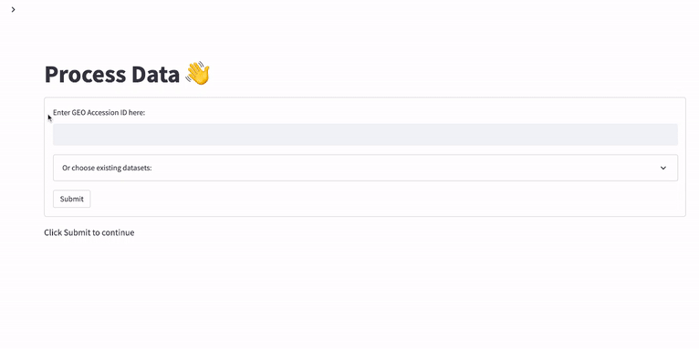
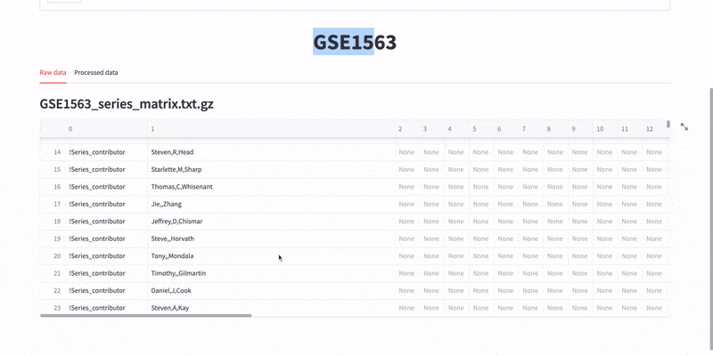
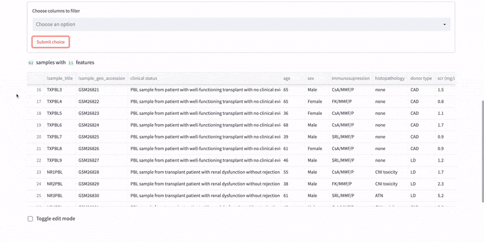
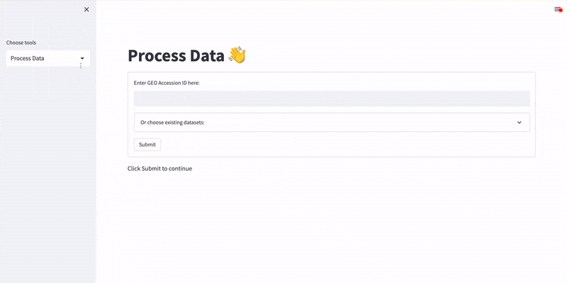
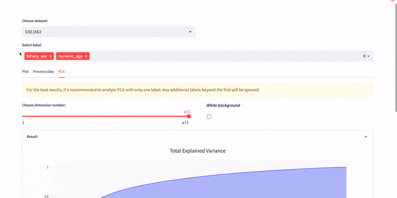
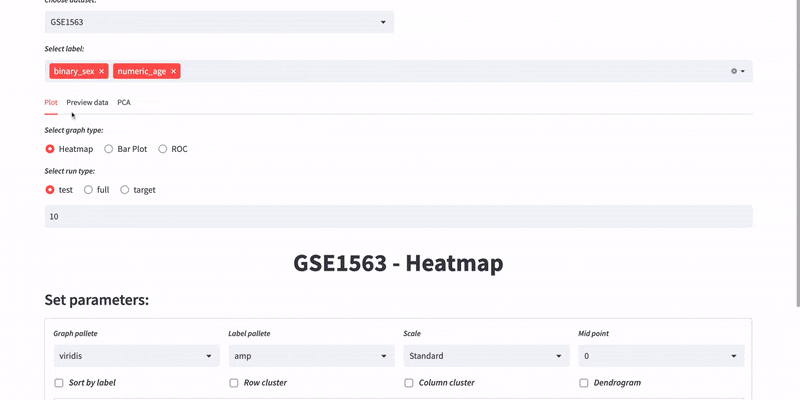
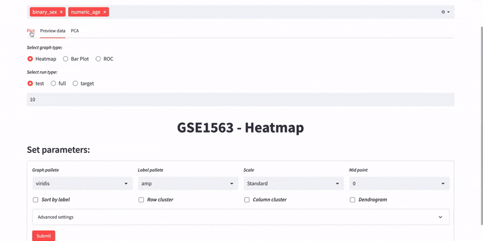
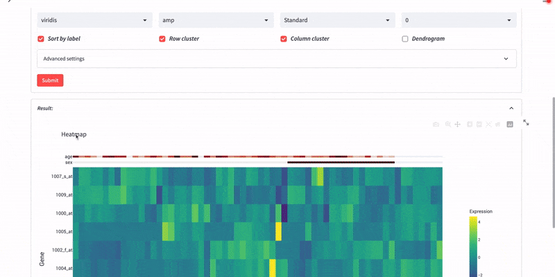

# GEO dataprocess streamlit

This repository contains an interactive Streamlit app for processing and visualizing GEO data from NCBI's Gene Expression Omnibus. The web app allows users to derive datasets from GEO and automatically perform data preprocessing such as normalization, filtering, and differential expression. This app can be useful for researchers who are working with RNA-Seq data and trying to identify differentially expressed genes for further analysis.

## Features

- Parsing of GEO formatted files
- Auto data cleansing and processing
- Quality control including PCA and heatmap analysis
- Differential expression analyses based on predefined criteria, with visualization and figure download options

## Installation

To run the app locally, first clone the repository:

```bash
git clone https://github.com/mitumh3/GEO-dataprocess-streamlit.git
```

Next, navigate to the directory and install the necessary packages. It's recommended to use a virtual environment to install the packages.

```bash
pip install -r requirements.txt
```

To run the app, type:

```bash
streamlit run scripts/src/main.py
```

## Demo

- Derive GEO files from <https://www.ncbi.nlm.nih.gov/geo/> by Accession ID

<div align="center">
  
</div>

- Raw and processed data
- Column filter of clinical data

<div align="center">
  
</div>

- Edit mode of clinical data and export files

<div align="center">
  
</div>

- Plot page

<div align="center">
  
</div>

- Preview data

<div align="center">
  
</div>

- PCA analysis

<div align="center">
  
</div>

- Heatmap

<div align="center">
  
</div>

- Dendrogram

<div align="center">
  
</div>